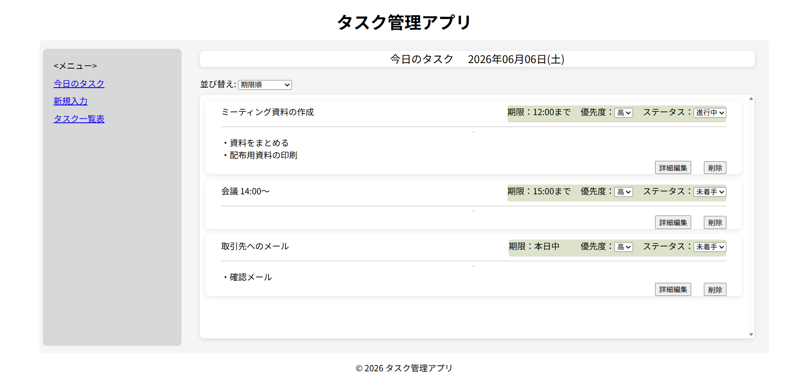
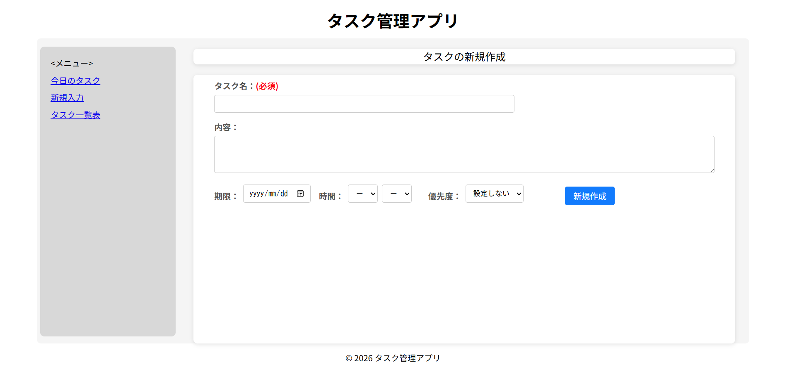
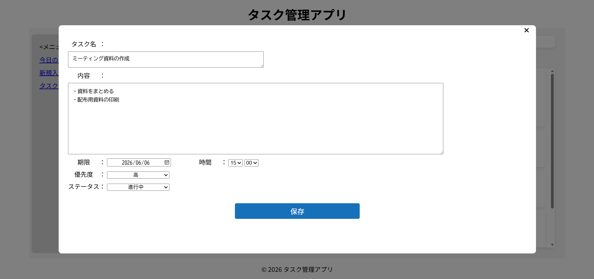

# タスク管理アプリ
## 概要
タスクの登録・管理を行うWebアプリケーションです。

## 画面イメージ

### タスク表示画面

### タスク登録画面

### タスク編集画面

## 使用技術
- HTML
- CSS
- JavaScript
- PHP
- MySQL

## 実装機能
- タスク一覧表示
- タスク登録
- タスク編集
- タスク削除
- ソート機能
- データベース連携

## 工夫した点
- PHPとMySQLを連携し、タスク情報を永続化
- 一覧画面でソート機能を実装し、目的のタスクを見つけやすくした
- 登録・編集・削除の処理を分けて実装し、保守しやすい構成を意識した

## 動作環境
- XAMPP
- PHP 8.2
- MariaDB 10.4
- Apache

## セットアップ
開発環境は XAMPP を使用しています。
データベースには MariaDB を利用しています。

